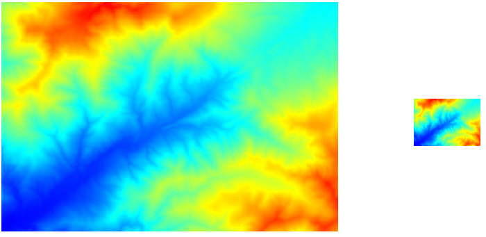
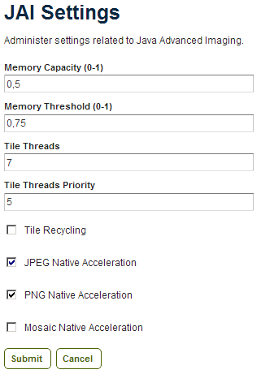

Optimizing raster data in GeoServer
===================================

---

Goal
----

Improve GeoServer performance

---

Content
-------

- Modifying the data 

- Configuring everything from the data to GeoServer

---

Main objectives
---------------

- Minimizing data access

- Minimizing processing

- Executing calculations in advance 

- Fine tuning GeoServer

- Fine tuning related software 

---

What's covered?
---------------

- Strategies for preparing data (theory) 

- Tools and examples of preparing data (practice)

- GeoServer configuration tips - how to optimize your data

---

What's not covered?
-------------------

- Other configurations - such as styling

---

Workshops
---------

- *Geoserver in production* workshop

- This Workshop 
	- adopts a more practical approach

	- is focused on data, not just on GeoServer 

- You are going to actually see how it is done

---

Preparing data
==============

---

Why?
----

- Ensure minimum size and fast access

- Avoid costly operations later

- Benefits are not limited to GeoServer

---

Factors affecting performance
-----------------------------

- Viewing unnecessary data 
	- rendering an area smaller than image
	- render detail lower than image resolution  

- Slow data access 
	- too much data
 	- too expensive to read or prepare it

---

---

---

Important factors 
-----------------

- File format and properties
- File size
- Structure and layout
- Number of Bands/Interleaving
- Data structure and layout
- CRS

Consider all factors together!

---

Format 
--------

- Binary vs. text-based

- Compression

- Inner tiling

- Overviews

- Color representation

---

File formats
------------

- ASC

- TIFF

- PNG

- JPEG

- JPEG2000

- Proprietary formats (MrSid, ECW)

---

Compression options
-------------------

- No compression

- Lossy

- Loseless

  
Did you know .... 

  Compression can sometimes make your files larger!

---

Compression methods
-------------------

- JPEG 
 	- lossy 
 	- visually lossless

- LZW
	- lossless
	- good for images with homogeneous areas
	- good for images with few colors	
	- recommended for non-image data (temperature, elevation, and so on)

- Wavelets

---

Color representation
--------------------

- RGB: 3 color components stored for each pixel
	- RGB images = generally larger

- Palette: 1 index value stored for each pixel
	- Paletted images = limited number of colors but smaller data volume

- Representation depends on image characteristics

- Related to compression method (spatial autocorrelation)

---
RGB vs Paletted
---------------

-----

TIFF format
-----------

- Representation depends on image characteristics

- Also related to compression method

---

TIFF format
-----------

- Versatile format

- Supports inner tiling

- Supports overviews

- Supports different compression methods

- GeoTiff

- BigTiff

---

Number of bands / interleaving
-------------------------------

- Clean unused band if multispectral

- Band interleaving generally better than pixel interleaving
	- RRRGGGBBB *vs* RGBRGBRGB

---

Strategies for data structuring
-------------------------------

- Single file

- Mosaic (tiles)

- Pyramid

- Dependent on data size and file format

---
Mosaic
------

---
Pyramid
-------

---

Suggestions for data structuring
--------------------------------

(Assuming Tiff format in all cases)

- If data < 4 Gb - a single (well prepared!) file 

- If data > 4 Gb - mosaic (with well prepared tiles!)

- Massive data - create a pyramid (with well prepared mosaics!) 

- Testing

- Balancing overhead of more complex structures

- Structure depends on data size and file format

---

Single file
-----------

- File format and characteristics are crucial

- Apply optimizations for single files to ALL files

- "Un-tiling" is a good idea in some cases (don't abuse the advanced features)

---

Mosaic (tiles)
--------------

- Tile size (not too small)

- Tiles with inner tiling

- Tiles with overviews

---

Pyramid (overviews)
--------------------

- Number of levels (n = log2(width/tile_width))

- Resampling methods

- Each level is a mosaic

---

GDAL tools
----------

- ``gdaltranslate``—Format conversion and reprojection

- ``gdaladdo`` —Adding overviews

- ``gdal_retile``—Tiling

- ``gdal_merge``—Merging, "un-tiling"

- ``rgb2pct``—Creation of paletted images

---

``gdaltranslate``
-----------------

- Modifiers
	- ``-t_srs``: Reprojection
	- ``-co``: Format specific values (TIFF)
		- ``TILED=TRUE``
		- ``COMPRESS=JPEG/LZW``
		- ``BLOCKXSIZE``, ``BLOCKYSIZE``
	- ``-b``: Band to use

---
Demo
----

	Data preparation

---

Other tools
-----------

- QGIS as GDAL front-end

- Other QGIS tools

---
Demo
----

Other tools 

---

GeoServer elements
===================

---

ImageMosaic plug-in
-------------------

- Automatically creates mosaic from result of ``gdal_retile``

- Tiles should be homogeneous

- Pre-installed with Suite

- If data already tiled (not with ``gdal_retile``) index file can be created manually

---

ImagePyramid plug-in
--------------------

- Based on ImageMosaic plug-in

- Automatically creates pyramid for result of ``gdal_retile``

- Has to be manually installed

- If data already tiled (not with ``gdal_retile``) index files can be created manually

---

Fine tuning GeoServer
=====================

---

ImageMosaic plug-in settings
----------------------------

---

ImageMosaic plug-in settings
----------------------------

- Part of Geoserver UI
	- Configuring multi-threading

- ``.properties`` file

	- ``Caching``
	- ``ExpandtoRGB``

---

ImagePyramid plug-in settings
-----------------------------

- Based on ImageMosaic

- Similar settings and ideas

---

Coverage Access settings
---------------------------

- Optimizing mosaic multi-threaded access
- Use 2 X #cores threads
- Threshold for WCS requests

---

JAI settings
----------------------

---

JAI settings
----------------------

- Use native JAI

- Use native ImageIO

- Enable native mosaic acceleration

- Enable tile Recycling if there are no memory problems

- Use 2 X #cores in Tile Threads

---

Reprojection settings
---------------------

- ``-Dorg.geotools.referencing.resampleTolerance``

- Default value of 0.333

- Larger values = better performance but less precision

- Set accordingly with dataset characteristics and goals

- Select the most appropriate CRS

